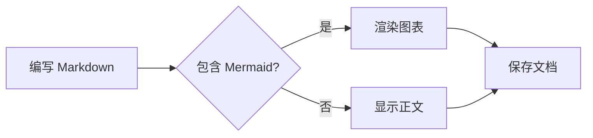
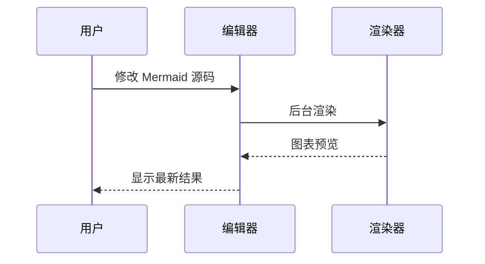

# Mermaid 文档示例

图表离线渲染。悬停时显示左上角的「渲染 / 源码」分段控件和右上角更多菜单；使用分段控件切换视图，在源码视图中修改图表。

## 中文流程图

```mermaid
flowchart LR
    A[编写 Markdown] --> B{包含 Mermaid?}
    B -->|是| C[渲染图表]
    B -->|否| D[显示正文]
    C --> E[保存文档]
    D --> E
```

## 时序图

```mermaid
sequenceDiagram
    participant U as 用户
    participant E as 编辑器
    participant R as 渲染器
    U->>E: 修改 Mermaid 源码
    E->>R: 后台渲染
    R-->>E: 图表预览
    E-->>U: 显示最新结果
```

## 无效语法

下面的错误只影响这个图表，源码仍可编辑，文档内容不会丢失。

```mermaid
invalidDiagram
```
